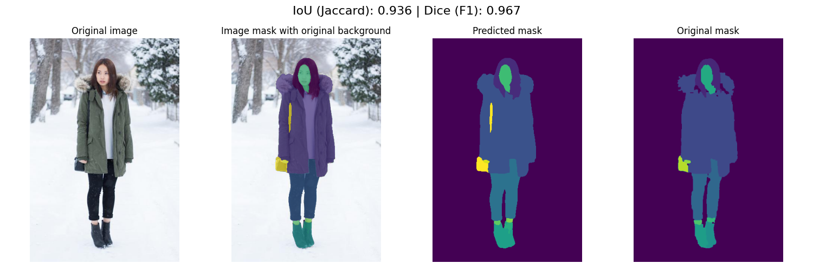

# Projet 3 OC – Segmentation d’images de vêtements / Project 3 OC – Clothing Image Segmentation

[](#)
[](#)


## Preview


---

🇫🇷 Version française

Ceci est le dépôt GitHub d’un projet réalisé dans le cadre de ma formation **Développeur IA** avec OpenClassrooms.
L’objectif du projet est de réaliser une **segmentation d’images de vêtements**, à partir d’un dataset d’images et de masques.

Le pipeline inclut :

- Vérification et création des répertoires nécessaires

- Chargement des images et des masques associés

- Redimensionnement des images et des masques

- Application d’un algorithme de segmentation par lot

- Affichage des résultats de segmentation (image + image / sortie du modèle + sortie du modèle + masque)

## Technologies utilisées

- **Python 3.11**

- **Poetry** - Gestion des dépendances

- **NumPy** - Manipulation de matrices/images

- **Pillow** - Traitement d’images

- **Requests** - Gestion des appels API

- **Matplotlib** - Visualisation des résultats

- **scikit-learn** - Evaluation du modèle

## Installation & utilisation

1. Cloner le dépôt
``` bash
git clone https://github.com/ifTrueReturnFalse/retraining-clothing-image-segmentation.git
cd retraining-clothing-image-segmentation
```

2. Installer les dépendances avec Poetry 
``` bash
poetry install
```

3. Insérez votre token HuggingFace dans le fichier ```.env``` 

``` bash
HUGGINGFACE_API_TOKEN="YOUR_TOKEN"
```

4. Configurer vos répertoires dans ```main.py``` 
``` Python
image_dir = "content/IMG"
mask_dir = "content/Mask"
resized_images_dir = "content/IMG_resized"
resized_masks_dir = "content/Mask_resized"
```

5. Mettez vos photos et masques dans les répertoires correspondants

6. Lancer le script principal 
``` bash
poetry run python src/main.py
```

Les résultats de segmentation s’afficheront directement sous forme de graphiques.

🇬🇧 English version

This is the GitHub repository of a project carried out as part of my **AI Developer** training with OpenClassrooms.
The goal of the project is to perform **clothing image segmentation**, using a dataset of images and masks.

The pipeline includes:

- Checking and creating the required directories

- Loading images and associated masks

- Resizing images and masks

- Applying a batch segmentation algorithm

- Displaying segmentation results (original image + model output + mask)

## Technologies used

- **Python 3.11**

- **Poetry** - Dependency management

- **NumPy** - Array/image manipulation

- **Pillow** - Image processing

- **Requests** - API calls management

- **Matplotlib** - Result visualization

- **scikit-learn** - Model evaluation

## Installation & usage

1. Clone the repository
``` bash
git clone https://github.com/ifTrueReturnFalse/retraining-clothing-image-segmentation.git
cd retraining-clothing-image-segmentation
```

2. Install dependencies with Poetry
``` bash
poetry install
```

3. Insert your Hugging Face token into a ```.env``` file

``` bash
HUGGINGFACE_API_TOKEN="YOUR_TOKEN"
```

4. Configure your directories in ```main.py```

``` Python
image_dir = "content/IMG"
mask_dir = "content/Mask"
resized_images_dir = "content/IMG_resized"
resized_masks_dir = "content/Mask_resized"
```

5. Place your images and masks into the corresponding directories

6. Run the main script
``` bash
poetry run python src/main.py
```

Segmentation results will be displayed directly as plots.
